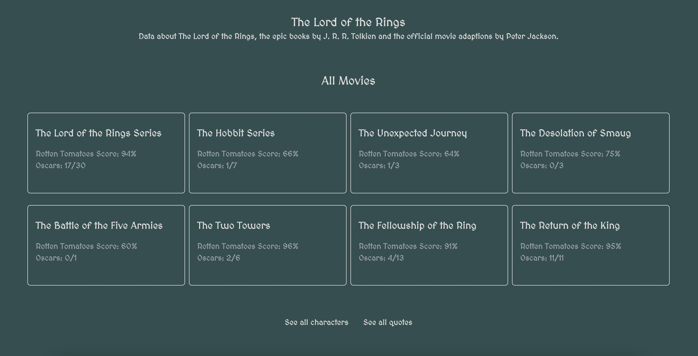
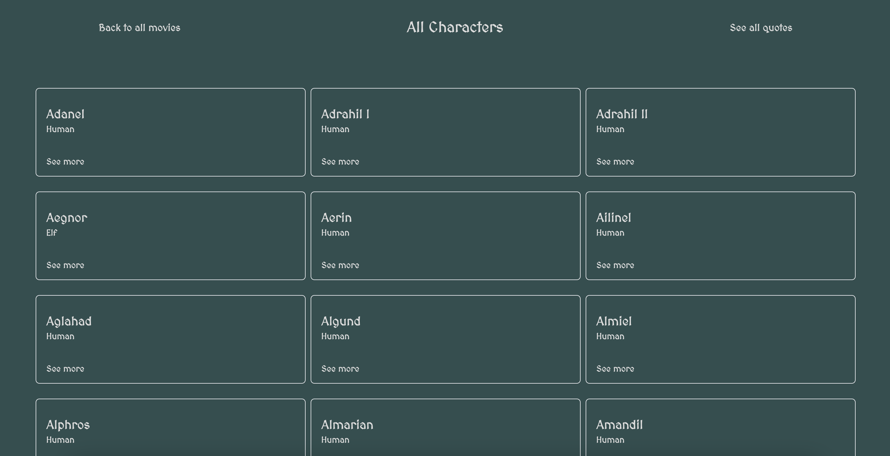
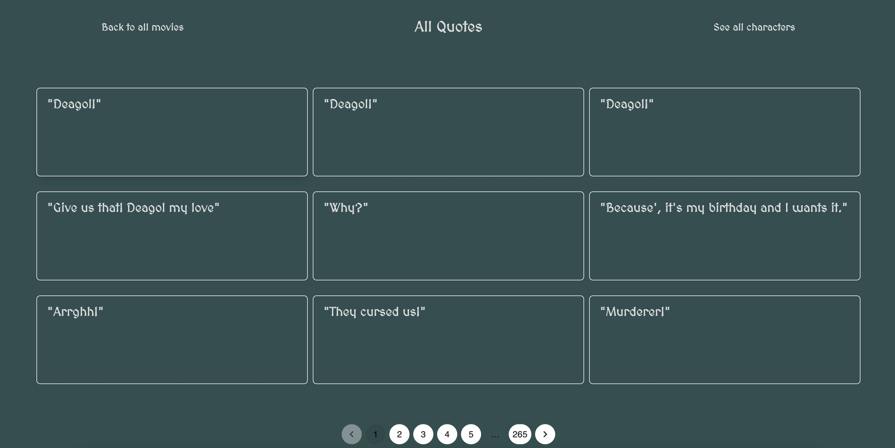
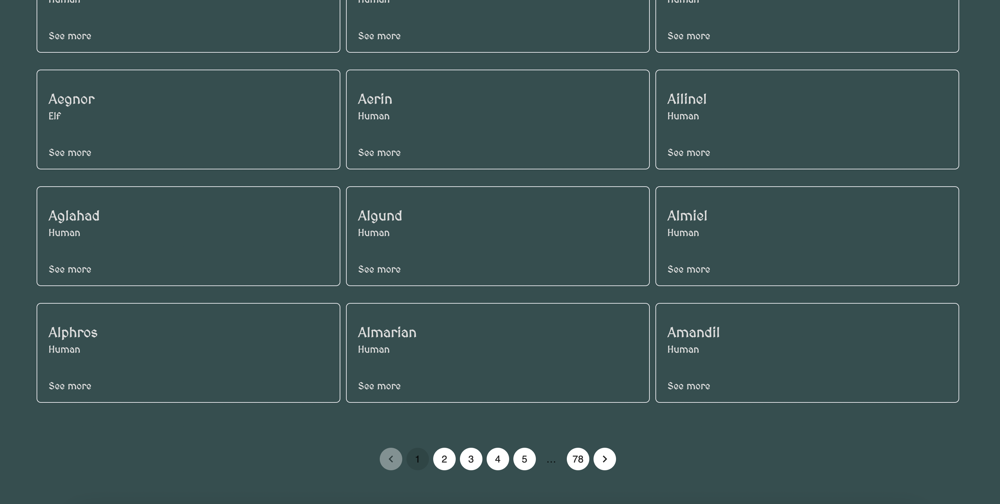

<h1 align="center">Lord of the Rings API - NextJS (Server side components)</h1>

## :memo: Description
Goal: Build a React application that consumes the API from The Lord of the Rings and displays the information on your website. We want to only display the movies, characters, and quotes models. You can ignore the other models. Feel free to use any additional library you want as long as you use React and Typescript.

## :framed_picture: Screenshots
<div display="flex">
    
    
    
    
</div>

## :wrench: Technologies Used


## :rocket: Getting Started

### Prerequisites
- Node.js and npm should be installed on your machine.

### Installation

1. Clone the repository:
```
git clone https://github.com/igornog/LordOfTheRingsAPI_NextJS-SSC
```
2. Navigate to the project file:
```
cd LordOfTheRingsAPI_NextJS-SSC
```
3. Install dependencies:
```
yarn install
```

### Running the Project
1. Start the application:
```
yarn dev
```
2. Open the browser on the designated URL to view the app.
## Deploy on Vercel

The easiest way to deploy your Next.js app is to use the [Vercel Platform](https://vercel.com/new?utm_medium=default-template&filter=next.js&utm_source=create-next-app&utm_campaign=create-next-app-readme) from the creators of Next.js.

Check out our [Next.js deployment documentation](https://nextjs.org/docs/deployment) for more details.

# See it live
https://igor-nogueira-project.vercel.app/

